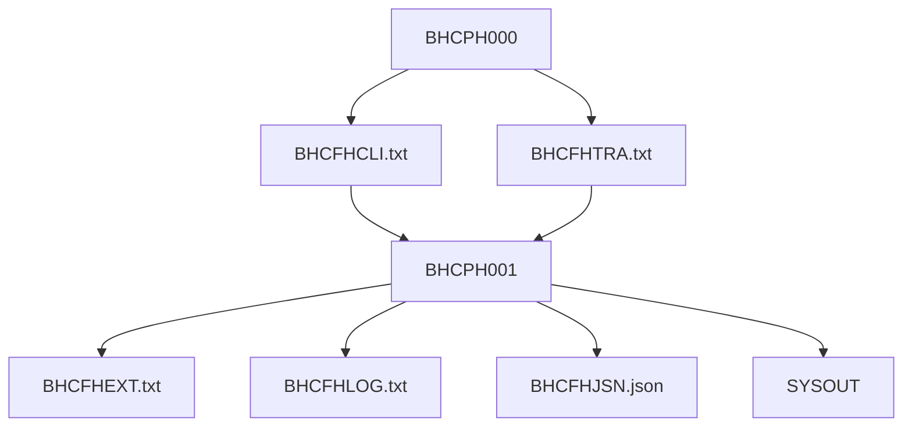

# Sistema Financeiro - Finance Core

Este repositório contém a solução do desafio final do Hackathon COBOL 2026.
A implementação segue o modelo Batch com arquivos sequenciais `LINE SEQUENTIAL`, processamento de clientes e transações, regras de negócio centralizadas, geração de extrato, log de rejeições e JSON manual.

## Visão Geral

O fluxo do desafio é:

1. `BHCPH000` gera a massa oficial de entrada.
2. `BHCPH001` lê essa massa e processa o sistema financeiro.
3. `BHCSH001` valida a transação financeira e devolve código e mensagem.

## Validação Por Arquivo

### BHCPH000
Validado contra o PDF como o gerador da massa oficial.

- gera `BHCFHCLI.txt` com exatamente 20 clientes;
- gera `BHCFHTRA.txt` com exatamente 40 transações;
- usa `OPEN OUTPUT`;
- usa `WRITE FROM`;
- usa `LINE SEQUENTIAL`;
- mantém totalizadores na SYSOUT;
- finaliza com `GOBACK`.

Regras cobertas pelo programa:
- cliente com código, nome, CPF, saldo e status;
- saldo com 11 dígitos implícitos e 2 casas decimais;
- transações com tipo, valor e data;
- registros oficiais exatamente na ordem do enunciado.

Saída esperada:
- `BHCFHCLI.txt` com 20 registros;
- `BHCFHTRA.txt` com 40 registros;
- SYSOUT com total de clientes gravados e total de transações gravadas.

### BHCPH001
Validado contra o PDF como o processador principal.

- lê `BHCFHCLI.txt` e `BHCFHTRA.txt`;
- carrega os clientes em tabela interna com `OCCURS`;
- valida as transações chamando `BHCSH001`;
- atualiza saldo apenas para transações válidas;
- gera `BHCFHEXT.txt` para válidas;
- gera `BHCFHLOG.txt` para rejeitadas;
- gera `BHCFHJSN.json` manualmente;
- controla `FILE STATUS`;
- exibe totalizadores;
- finaliza com `GOBACK`.

Regras cobertas pelo programa:
- cliente inexistente: código `01`;
- cliente inativo: código `02`;
- cliente bloqueado: código `03`;
- tipo inválido: código `04`;
- valor zero: código `05`;
- saldo insuficiente: código `06`;
- depósito soma ao saldo;
- saque subtrai do saldo;
- pagamento subtrai do saldo.

Saída esperada:
- `BHCFHEXT.txt` com as transações válidas;
- `BHCFHLOG.txt` com as rejeições;
- `BHCFHJSN.json` com o resumo e a lista de clientes com saldo final;
- SYSOUT com total de clientes lidos, transações lidas, válidas, rejeitadas, extrato, log e JSON.

### BHCSH001
Validado contra o PDF como subprograma de regra de negócio.

O subprograma recebe via `LINKAGE SECTION`:
- indicador de cliente encontrado;
- status do cliente;
- tipo da transação;
- valor da transação;
- saldo do cliente.

Ele devolve:
- código de retorno;
- mensagem de validação.

Regras cobertas pelo subprograma:
- cliente não encontrado;
- cliente inativo;
- cliente bloqueado;
- tipo inválido;
- valor inválido;
- saldo insuficiente.

## Entregáveis

Arquivos que você deve entregar no pacote final:

- [BHCPH000.cbl](BHCPH000.cbl)
- [BHCPH001.cbl](BHCPH001.cbl)
- [BHCSH001.cbl](BHCSH001.cbl)
- [BHCFHCLI.txt](BHCFHCLI.txt)
- [BHCFHTRA.txt](BHCFHTRA.txt)
- [BHCFHEXT.txt](BHCFHEXT.txt)
- [BHCFHLOG.txt](BHCFHLOG.txt)
- [BHCFHJSN.json](BHCFHJSN.json)
- evidência da SYSOUT do BHCPH000
- evidência da SYSOUT do BHCPH001

## Ordem Recomendada

1. Compile o `BHCPH000`.
2. Execute o `BHCPH000` e gere a massa.
3. Compile o `BHCSH001` como módulo/subprograma.
4. Compile o `BHCPH001`.
5. Execute o `BHCPH001` na mesma pasta onde estejam os arquivos gerados.

## Saída Esperada Em Resumo

### BHCPH000
- 20 clientes gravados
- 40 transações gravadas
- 0 erros, se o ambiente estiver correto

### BHCPH001
- 20 clientes lidos
- 40 transações lidas
- transações válidas e rejeitadas conforme a massa oficial
- extrato gerado para válidas
- log gerado para rejeitadas
- JSON final gerado

## Observação Importante

O `CALL 'BHCSH001'` depende do subprograma estar compilado e disponível no runtime. Se a sua IDE executar apenas o programa principal, o subprograma precisa estar no mesmo diretório de execução ou ser vinculado como módulo carregável.

## Arquivos Gerados

- `BHCFHCLI.txt` - cadastro de clientes
- `BHCFHTRA.txt` - transações
- `BHCFHEXT.txt` - extrato de transações válidas
- `BHCFHLOG.txt` - rejeições
- `BHCFHJSN.json` - JSON final

## Observação Final

O código foi montado para ser testado em outra IDE COBOL. A estrutura segue o padrão do desafio e o comportamento final depende do compilador e da forma como o subprograma é empacotado no ambiente local.